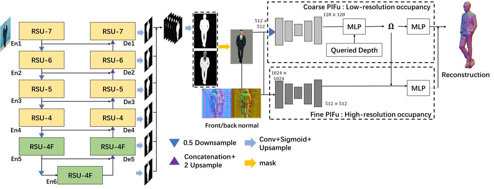

# U2 Net-Plus and Background Removal Based PIFu-HD : Human Body Reconstruction in Complex Background

The code repo for *U2 Net-Plus and Background Removal Based PIFu-HD : Human Body Reconstruction in Complex Background* [inderscience](https://www.inderscienceonline.com/doi/abs/10.1504/IJIMS.2022.128640).

## Introduction

Same action in different backgrounds perform differently using PIFu-HD. 


We use U2Net to do background removal. The PIFu-HD can achieve better performance because of the simpler background.



The 3D reconstruction performance are shown as follows.


Besides, we compare different U2Net structures, including dense connection, residual connection and multi-receptive-field connection.


We do image segmentation experiments on two benchmarks: [Daimler Pedestrian Segmentation Benchmark Dataset](https://pure.uva.nl/ws/files/1696377/167436_paper0066.pdf) and [Deep Automatic Portrait Matting Dataset](https://link.springer.com/chapter/10.1007/978-3-319-46448-0_6), and multi-receptive-field connection achieves the best performance. 


## Environment

Install pytorch and torchvision

```bash
pip install torch==1.11.0+cu113 torchvision==0.12.0+cu113 --extra-index-url https://download.pytorch.org/whl/cu113
```

Install other dependencies.

```bash
pip install -r requirements.txt
```

## Experiments

`bodydataset_*`directories are experiments on *Daimler Pedestrian Segmentation Benchmark Dataset*.

`facedataset_*` directories are experiments on *Deep Automatic Portrait Matting Dataset*.

`*_originu2net` directories are experiments using vanilla U2Net.

`*_resu2net` directories are experiments using residual connection.

`*_u2netplus_3perceptionfields` directories are experiments using multi-receptive-field connection.

```bash
# training
python u2net_train.py
# inference
python inference.py
```

## Acknowledgement

We thank Shanghai Film Art Academy for providing training and testing data as well as standard dancing videos.

## Citation

Please cite the article or repo as

```text
@article{wang2022u2,
  title={U2 Net-Plus and background removal-based PIFu-HD: human body reconstruction in complex background},
  author={Wang, Guorun and Liu, Xudong and Lin, Kuo-Yi and Hwang, Fuhjiun},
  journal={International Journal of Internet Manufacturing and Services},
  volume={8},
  number={4},
  pages={330--351},
  year={2022},
  publisher={Inderscience Publishers (IEL)}
}
```
